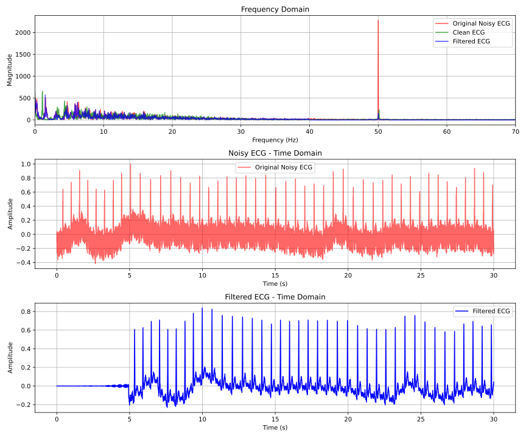

# ECG Signal Filtering and R-Peak Detection

## Introduction

In this assignment, two ECG signal datasets are provided: one recorded lying down with electrodes on the hip/shoulder, and the other recorded standing with electrodes on the ankles and wrists. The primary objective is to clean the ECG signals by removing noise using Finite Impulse Response (FIR) filters and Adaptive Least Mean Square (LMS) filters. Additionally, R-peak detection is required by using the R-peak template from the cleaned ECG signal.

## Tasks

### Task 1 & Task 2: FIR Filter Design

The goal of this task is to design a combined high-pass and band-stop FIR filter to remove low-frequency noise and 50Hz power-line interference from the ECG signal.

#### Procedure:
1. **Frequency Domain Plot**: A frequency domain plot of the ECG signal is created to identify noise frequencies. Based on the analysis, the cutoff frequency for the high-pass filter is set to 40 Hz, and the stop frequency for the band-stop filter is set to 50 Hz (for removing power-line interference).
   
2. **FIR Filter Coefficients Calculation**: A function is created to calculate the FIR filter coefficients based on the sampling rate, cutoff frequencies, and stop width. The total number of coefficients required for the FIR filter is computed and printed (9848 in this case).

3. **Filter Application**: The designed filter is applied to the ECG signal in a sample-by-sample manner to clean the ECG.

#### Results:
- **Figure 2**: Noisy ECG signal before filtering.
- **Figure 3**: Cleaned ECG signal after FIR filtering.

### Task 3: Adaptive LMS Filter Design

The purpose of this task is to apply an Adaptive LMS filter to remove DC noise and the 50Hz interference from the ECG signal. A reference noise signal, consisting of a 50Hz sine wave with added DC, is used for the filter.

#### Procedure:
1. **FIR Filtering**: The noisy ECG signal is first filtered using the FIR filter, and the result is saved to `filtered-ecg.dat`.

2. **LMS Filtering**: The noisy ECG signal is then filtered using the Adaptive LMS filter, and the results are saved to `lms-filtered-ecg.dat`.

3. **Filtered Signal Storage**: Both FIR-filtered and LMS-filtered ECG signals are stored in separate lists for further analysis.

#### Results:
- **Figure 4**: ECG signal after FIR filtering.
- **Figure 5**: ECG signal after applying the Adaptive LMS filter.

### Task 4: R-Peak Detection & Heart Rate Calculation

The final task is to detect the R-peaks in the filtered ECG signal and calculate the heart rate based on the RR intervals (the time difference between successive R-peaks).

#### Procedure:
1. **R-Peak Detection**: The `detect_r_peaks()` function is used to detect R-peaks in the Adaptive LMS filtered ECG signal. The function applies a peak detection algorithm that checks if a sample is higher than both its neighbors and above a threshold.

2. **Heart Rate Calculation**: The RR intervals (time between successive R-peaks) are calculated, and the heart rate is computed by converting the RR intervals to beats per minute (BPM).

#### Results:
- **Figure 6**: Detected R-peaks on the ECG signal.
- **Figure 7**: Momentary heart rate plot showing the heart rate at different time intervals.

## Conclusion

In this project, we successfully designed an FIR filter to reduce noise in the ECG signal, preserving essential diagnostic features such as the PQRST complex. Additionally, the Adaptive LMS filter demonstrated superior noise reduction in a shorter time duration. The momentary heart rate plot provided an estimate of the average heart rate of the patient, aiding in heart rate and rhythm analysis.

## Files

- `filtered-ecg.dat`: ECG signal after FIR filtering.
- `lms-filtered-ecg.dat`: ECG signal after Adaptive LMS filtering.
- `./processed-data-files/filtered_ecg.dat`: Path to the processed ECG data file.

## Requirements

- Python 3.x
- NumPy
- Matplotlib
- SciPy

## How to Run

1. Clone the repository:
   ```bash
   git clone <repository-url>
